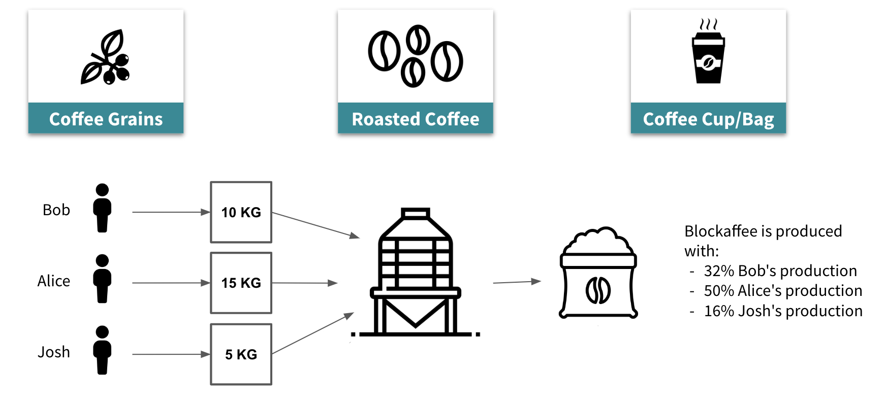

# Coffee Traceability
## Developed with [Convector](https://covalentx.com/convector) by [Covalent](https://covalentx.com)

This project covers the creation of multiple participants creating a coffee batch in conjuntion, then selle it to a coffee roaster participant. In the roast process you usually combine different grain batches, so the code takes that into consideration to be able to provide which percentage of the final result belongs to the original producers.

Here's a diagram explaining the overall process



---

This awesome project was created automatically with <a href="https://github.com/worldsibu/convector-cli" target="_blank">Convector CLI</a>.
By default new Convector projects locally include <a href="https://github.com/worldsibu/hurley">Hurley</a> to manage your development environment seamlessly, so you don't have to worry about setting up the network and hard ways to install  and upgrade your chaincodes.

## Start

```
# Install dependencies - From the root of your project
npm i

# Create a new development blockchain network  - From the root of your project
npm run env:restart

# Install your smart contract
npm run cc:start -- coffee

# Run the end-to-end tests invoking the ledger
npm run test:e2e
```

## About Hurley

You may as well install **Hurley** globally for easier and more flexible management. 

`npm i -g @worldsibu/hurley`

Since with Hurley globally you have control over everything, some things that you can do, for example, is installing a Convector Smart Contract with a different name than the one you used for your project.

```
# Use the same package
# Install a new chaincode with the same source code but the name 'anothernameforyourcc'
hurl install anothernameforyourcc node
```

Other complex tasks you may need is installing to a different channel.

```
# Use the same package
# Be sure you started your environment with more than one channel running 'hurl new --channels 2'. Otherwise this will throw an error.
hurl install anothernameforyourcc node --channel ch2
```

---

If you don't want to, don't worries! This project works right away.

## Start - if you have Hurley globally

### Bring your project to life 

```
# Install dependencies - From the root of your project
npm i
# Create a new development blockchain network  - From the root of your project
hurl new
```

###  Install and upgrade chaincodes

```
# Package your smart contract's code  - From the root of your project
npm run cc:package -- coffee org1
# Install to your blockchain - From the root of your project
hurl install coffee node -P ./chaincode-coffee
# Install in debug mode, this will run the chaincode server locally so you can debug
hurl install coffee node -P ./chaincode-coffee --debug

# Upgrade your existing chaincode - From the root of your project
hurl upgrade coffee node 1.2 -P ./chaincode-coffee
```

## Start - if you don't have Hurley globally

### Bring your project to life 

```
# Install dependencies - From the root of your project
npm i
# Create a new development blockchain network  - From the root of your project
npm run env:restart
```

###  Install and upgrade chaincodes

```
# Install to your blockchain - From the root of your project
npm run cc:start -- coffee

# Upgrade your existing chaincode - From the root of your project
npm run cc:upgrade -- coffee 1.2
```

## Tests

```
npm run test
npm run test:e2e
```

> Check all the information to work with Convector <a href="https://docs.covalentx.com/convector" target="_blank">in the DOCS site</a>.

## Collaborate to the Convector Suite projects

* <a href="https://community.covalentx.com" target="_blank">Discord chat with the community</a>
* <a href="https://github.com/worldsibu" target="_blank">Convector projects</a>
